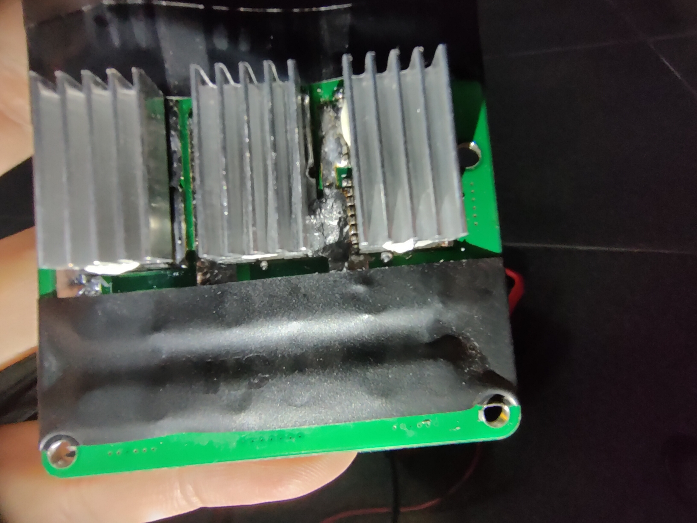
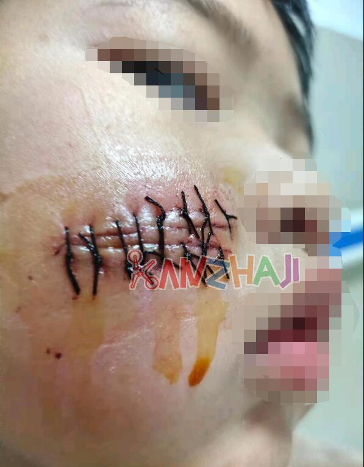

各位参与空中机器人工作的成员你好，在这里首先感谢你们的付出，下面请允许我提出几点2022赛季备赛过程中发现的各种问题与吸收的经验，也希望各位能够继续完善补充这篇文章。

# 机械组注意事项

## 1. 设计
大疆裁判系统出现过漏电事故，导致飞机差点自燃，设计安装时需绝缘

找电路要各种板子的安装孔位

桨保建议重新设计，换掉渔网+扎带的方案

## 2. 装配
螺丝和扎带不要留在不该出现的地方，包括各种小零件，尤其是桨保里面，不允许出现东西

剪扎带用尖嘴平口钳剪到根，不允许用剪刀或留出一截，容易划伤皮肤

## 3. 责任与义务

起飞前提醒车长和飞手是否测量过电池电压（毕竟如果炸机了机械就得加班）

每日起飞前检查所有螺丝是否上紧

---
炸机后在时间不够拆机检查且需要将飞手考核视频拍出来的时候，每次起飞前都要检查所有螺丝，并由车长和飞手评估机身安全性及稳定性，是否继续进行训练

-

-

# 电路组注意事项

## 1. 分电板方案

大功率输出时发热过高，没有采用高温锡丝（即无铅锡），导致焊锡融化，两组电池之间被连通，飞机炸机

经多次验证后，目前比较稳定的版本为通过mos管防止互充，先串后并的版本，采用无铅锡丝并为分电板加装散热风扇

## 2. 供电方案

前期实验时发现，四个螺旋桨停转瞬间造成的感生电压非常大，这个反向电流会瞬间打坏给机载电脑和飞控供电的降压模块，甚至造成了将飞控与机载电脑烧坏的严重经济损失

因此
目前飞控、机载电脑与大疆电源管理、裁判系统，包括云台，供电方案为共用一块电池
以上元件的供电必须独立于分电板，即不允许与螺旋桨电机相连

起飞前需测量每个电池的电压，电压最大值与最小值差值不得超过0.1V，即给螺旋桨供电的电池之间电压差要求在±0.05V

# 目前未解决的问题

飞控，机载电脑，大疆电源管理 并联在同一块电池的输出时
仅在赛场出现过两次 ，2022.06.16上午和下午各出现一次

裁判系统有电但飞控没电

的现象，且第一次现象出现时，反复开关电池无效；第二次现象发生时，开关电池飞控重新上电成功

-

-

声明：下文出现的配图可能引起不适，请除了车长及飞手之外的成员谨慎查阅

---

# 车长及飞手须知

# 第一准则：安全

没有完整的奖保前，不要带桨叶启动电机，更不要试飞

对于这些图片给你带来的不适我感到抱歉，但是这也是我希望车长和飞手能够牢记并且始终把它作为责任与压力的一部分。

这些图片仅仅只是F450尺寸或以大疆精灵4尺寸为标准的、空机质量不超过4kg的小型无人机造成的伤害,他们的电机的KV值普遍在九百以上。(对于无刷电机，这个值是个常量。电机的转速N（空载）= KV值 * 电压V)，即使是这些9英寸的桨叶，也能轻松划断肌腱与神经，让手指再也无法动弹。

那么，团队2022届空中机器人采用的电机为好盈X6系列，其官方标定参数180KV，在48V工作电压下，遥控器满油门电流为56.8A。

根据：

电机的功率计算公式：P=T*N/9549

以及上面对KV值的定义，

得出在48V电压下且满油门时

T = 9549 * P / KV * V = 3013.24 (N.m)

配合2388桨叶，即23英寸（0.584m）直径

我们不难想象，这样的力道和速度下，桨叶对人体造成的伤害是致命的。

因此，

# 作为车长和飞手，需要时刻牢记：

如果发生了危害人身安全或严重的安全事故，学校必定会责令DynamicX解散。造成事故的成员也会被追究相应责任，请严格遵守法律。

所以我个人绝对不建议，甚至希望严禁空中机器人出现在人口密集的场所进行活动。

这也是为什么所有飞机在起飞之前第一件应该做的事情就是确保桨保安装正确，防止射桨，降低事故的危害。

请作为空中机器人第一责任人的车长和飞手重视。

---

首先，车长必须对机械和电路进行学习了解，与相关负责人沟通后能理解并发现可能导致事故的要点

务必监督并检查机械组的装配，当机械梯度成员负责对奖保或机身主体进行装配时，

**尤其是发现零件异常扭曲变形时**，
# 一定千万不要相信机械组的鬼话：“这里一会拧紧螺丝就行了”。
请车长必须马上检查零件之间的配合问题，并找到主要负责设计空中机器人的机械组正式成员反映问题，一起检查并定位现象的起因如：设计不合理，卡口或键槽未安装到位，材料强度不足等

起飞前检查电池物理开关

检查遥控器模式

模拟演练发生危险时打开kill switch，以保证炸机时在飞机接触地面后立刻开启紧急停奖开关

### 发生炸机后如何处理

